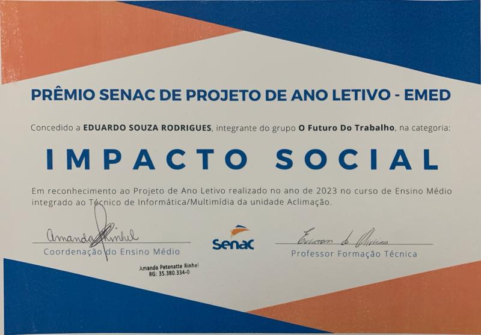

# SENAC School Year Projects - README

**© 2024-2025 Eduardo Souza Rodrigues - Licensed for Educational Use Only**  
*Protected under Brazilian Law 9,610/98 - Strictly Non-Commercial Academic Use*

## Project Overview

Welcome to the README for my SENAC School Year Projects. These initiatives were developed as part of my coursework at SENAC, with a focus on creating a positive impact on society. Below, you'll find information about both projects, with a special mention of the prize-winning project.

## Project Details

1. **Project 1: Marijuana Legalization and Drug Use in Adolescence**
    - **Description:** This school project website explores marijuana legalization and drug use in adolescence. It aims to provide factual information, raise awareness, and prevent substance abuse among teens.
    - **Technologies:** HTML, CSS
    - **Note:** This website is in Portuguese. If you need to translate it into another language, you should use a translation service.

2. **Project 2 (Prize Winner): The Future of Work**
    - **Description:** This school project website delves into the future of work, providing factual information, exploring trends and challenges, and inspiring young people to prepare for their careers.
    - **Technologies:** HTML, CSS, JavaScript, Bootstrap, VLibras (a suite of free and open-source tools that automatically translates digital content from Portuguese to Brazilian Sign Language).
    - **Note:** This website is in Portuguese. If you need to translate it into another language, you should use a translation service.

## Certificate - Impacto Social SENAC 2023

*Caption: Certificate awarded for the Impacto Social SENAC 2023 prize, presented to Project 2.*

Feel free to explore the projects further, and if you have any questions or need additional information, please don't hesitate to reach out.

---

**Copyright © 2022-2024 Eduardo2580. All rights reserved.**
